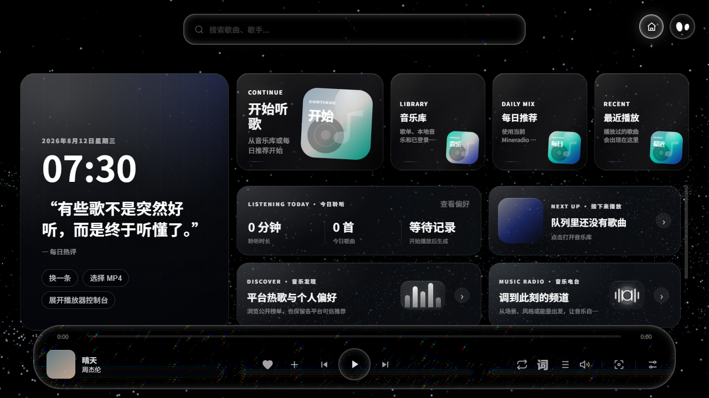
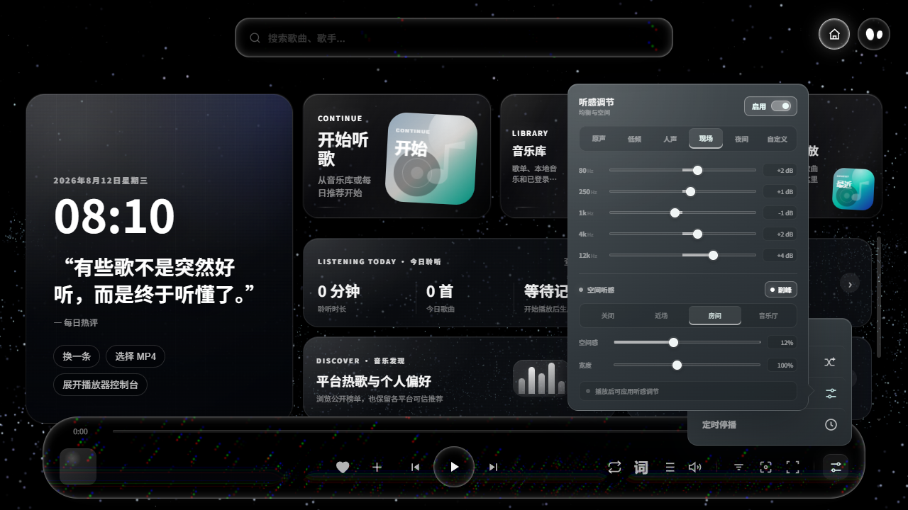

# Mineradio Next

Mineradio Next 是面向 Windows 的开源桌面音乐播放器。它将在线音乐、本地曲库、歌词、播放工具和桌面模式放在同一个应用中。

[下载 Windows 版](https://github.com/Mineradio-Next/Mineradio-Next/releases) · [查看隐私说明](./PRIVACY.md) · [报告问题](https://github.com/Mineradio-Next/Mineradio-Next/issues)



## 你可以用它做什么

Mineradio Next 当前包含以下主要能力：

- 搜索和播放多个音乐来源，查看平台排行与每日推荐
- 独立登录酷狗概念版，读取推荐、云歌单和红心，并同步账号收藏
- 导入本地音乐，管理歌单、收藏、播放历史和离线内容
- 使用歌词舞台、桌面歌词和三轨歌词编辑器
- 调整均衡器、前级增益、空间听感、播放速度和音高
- 使用音乐电台、音乐星图、粒子视觉和 3D 歌单架
- 通过迷你播放器、系统媒体键、托盘和局域网遥控控制播放
- 将本地视频或 Wallpaper Engine 内容用于桌面模式



## 下载与安装

Mineradio Next 支持 Windows 10 和 Windows 11 x64。

1. 打开 [Releases](https://github.com/Mineradio-Next/Mineradio-Next/releases)
2. 下载 `Mineradio-Next-版本号-Setup.exe`
3. 运行安装器，使用默认设置或打开安装选项

Release 中的 `.blockmap` 和 `latest.yml` 用于版本更新，不是安装包。`SHA256SUMS.txt` 可用于校验下载文件。

当前安装包没有代码签名。Windows SmartScreen 可能显示“未知发布者”，请确认文件来自本仓库的 Releases 页面。

## 数据与账号

应用数据保存在 `%APPDATA%\Mineradio`。从原版 Mineradio 升级时，安装器会保留账号、设置和歌单。

部分在线功能取决于音乐平台接口、账号地区和会员权益。Mineradio Next 不是网易云音乐、QQ 音乐、酷狗音乐、Spotify、汽水音乐或其他音乐平台的官方客户端，也不提供音乐内容。

普通酷狗与酷狗概念版使用独立会话、歌单和收藏状态。概念版接口变化或授权不足时，应用会保留只读能力并显示真实状态，不会将操作伪装成同步成功。

Cookie、Token、播放历史、搜索历史、用户封面、歌词、缓存和本地音乐不会提交到 Git 仓库。详情见 [PRIVACY.md](./PRIVACY.md)。

## 从源码运行

开发环境需要 Windows 10 或 Windows 11、Node.js 20 或更高版本，以及 npm。

```powershell
git clone https://github.com/Mineradio-Next/Mineradio-Next.git
cd Mineradio-Next
npm ci
npm start
```

运行测试和项目检查：

```powershell
npm test
npm run check
npm run security:audit
```

构建 Windows 安装包：

```powershell
npm run build:win
```

构建产物位于 `dist/`。

## 参与开发

提交改动前，请先运行测试、项目检查和依赖审计。问题报告应包含复现步骤、实际结果、预期结果和相关日志，账号凭据与私人媒体文件不要上传到 Issue。

项目会持续跟踪原版 Mineradio 与 Mineradio-LX-Music 的公开更新，但不会自动合并上游提交。维护规则和当前基线见 [NEXT_BASELINE.md](./docs/NEXT_BASELINE.md)。

## 来源与许可证

Mineradio Next 基于 [XxHuberrr/Mineradio](https://github.com/XxHuberrr/Mineradio) 继续开发，并参考了 [ww085213/Mineradio-LX-Music](https://github.com/ww085213/Mineradio-LX-Music) 中适合本项目的实现。

完整来源、移植记录和第三方说明见 [NOTICE.md](./NOTICE.md) 与 [THIRD_PARTY_PORTS.md](./docs/THIRD_PARTY_PORTS.md)。

项目使用 [GNU General Public License v3.0](./LICENSE)。分发修改版或安装包时，请同时遵守许可证和 NOTICE 中的署名要求。
